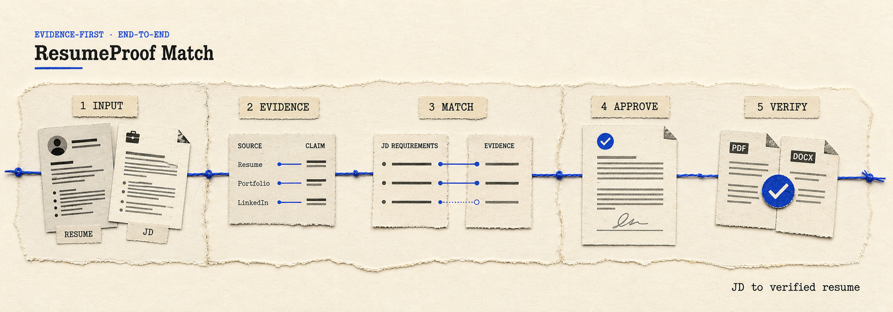

  

  <strong>先判断是否匹配，再证明每句话，审核后才生成。</strong>

  <a href="README.md">English</a> ·
  <a href="#安装">安装</a> ·
  <a href="#完整流程">完整流程</a>

# ResumeProof Match

ResumeProof Match 是一个面向 AI Agent 的端到端 Skill，把“简历与 JD 匹配分析”和“基于证据生成、审核、验收简历”合并成一条工作流。

它连续解决两个问题：

1. 这个岗位值不值得投，判断依据是什么？
2. 如何把已有证据写成针对性简历，同时不编造、不夸大？

很多匹配工具给完分数就结束，很多简历工具在事实尚未确认时就开始生成。ResumeProof Match 用同一条可审计的证据链连接两者。

## 核心特点

- **逐项解释匹配依据**：每个结论都能回到 JD 原句和具体简历证据。
- **三个分数分开看**：岗位匹配度、证据覆盖率、文档就绪度互不替代。
- **不伪装成 ATS 通过率**：评分只辅助决策，不预测招聘系统行为。
- **优化建议有事实状态**：区分“已有证据”“需要确认”“暂不支持”。
- **完整文字稿强制审核**：未经用户明确批准，不生成 HTML、DOCX 或 PDF。
- **QA 与文件哈希绑定**：文字或输出文件变化后，旧的验收结果自动失效。
- **轻量可移植**：核心仅使用 Python 标准库，不需要账号、数据库、RAG 或向量库。

## 安装

\`\`\`bash
npx skills add caihhhhhh/resume-proof-match -g
\`\`\`

安装后，将简历与完整 JD 一起交给 Agent：

> 使用 $resume-proof-match 对比我的简历和这份 JD，说明每个匹配结论的证据，给出真实可用的优化建议，并在生成文件前先让我审核完整文字稿。

## 完整流程

\`\`\`text
简历 + JD + 补充资料
          ↓
拆解岗位要求与硬门槛
          ↓
建立“事实—来源”证据台账
          ↓
生成可解释的匹配与差距报告
          ↓
用户选择要采用的修改
          ↓
完整文字稿审核与批准
          ↓
生成可编辑源文件和 PDF
          ↓
QA 验收与版本化交付
\`\`\`

辅助脚本负责创建工作区、检查跨文件引用、计算分数、记录文字稿批准、绑定 QA 哈希，并阻止不安全交付。

\`\`\`bash
python scripts/resume_proof_match.py new \
  --company "示例公司" \
  --role "增长分析师" \
  --language zh

python scripts/resume_proof_match.py score Resume_Output/Applications/<目录> --write
python scripts/resume_proof_match.py approve Resume_Output/Applications/<目录>
python scripts/resume_proof_match.py inspect resume.pdf --max-pages 2
python scripts/resume_proof_match.py qa Resume_Output/Applications/<目录> \
  --file resume.pdf --text passed --facts passed --pagination passed --visual passed
python scripts/resume_proof_match.py deliver Resume_Output/Applications/<目录> \
  --file resume.pdf --delivery-dir Resume_Output/Delivery
\`\`\`

Agent 负责语义分析与写作，CLI 只处理适合确定性执行的状态、引用、评分、批准和交付规则。PDF 文字检查会在可用时调用可选的 \`pypdf\` 或 \`pdftotext\`。

## 评分逻辑

JD 要求分为“必须满足”“加分项”和“不得出现”。正向要求按重要程度动态加权，必须项权重更高；匹配状态分为已有证据、需要确认和暂不支持。

简历排版与表达质量单独计算，避免“文档做得漂亮”掩盖关键资历缺失。完整规则见 [匹配模型](references/matching.md)。

## 隐私与安全

真实简历、个人资料、填充后的证据台账和申请工作区应保存在仓库之外。提交前可运行：

\`\`\`bash
python scripts/resume_proof_match.py safety .
\`\`\`

该 Skill 不会自行投递岗位、上传文件、发布内容、发送邮件或把文件复制到桌面；这些动作都需要用户单独明确授权。

## 本地验证

\`\`\`bash
python -m unittest discover -s tests -v
python scripts/resume_proof_match.py safety .
\`\`\`

项目采用 [MIT License](LICENSE)。
